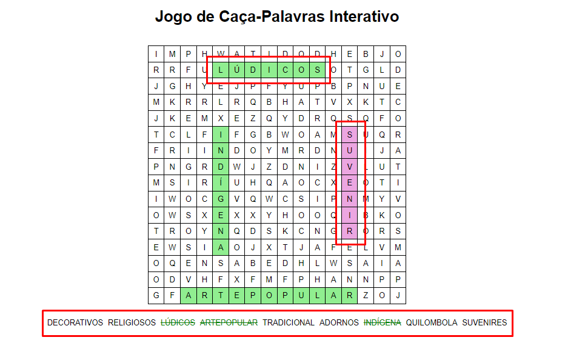
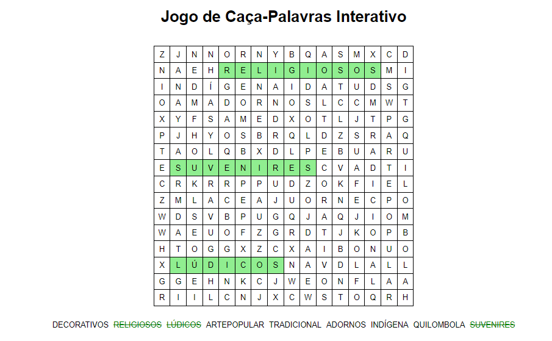

# Jogo de Caça-Palavras Interativo

Este é um jogo de caça-palavras interativo, onde os usuários podem procurar palavras em uma grade e marcá-las quando encontradas.

## Funcionalidades

- **Grade de 16x16**: Células preenchidas com letras aleatórias e palavras ocultas.
- **Interação**: Clique e arraste para selecionar células na grade.
- **Verificação de Palavras**: Seleções válidas são destacadas de verde na grade quando você encontra corretamente a palavra e na parte de baixo as palavras são riscadas na lista para que assim, possa facilitar ver quantas palavras faltam.

## Instalação

1. Clone o repositório:
   ```bash
   git clone https://github.com/joycebeatriz/cacapalavras.git

Abra o arquivo `index.html` em um navegador web para jogar. (Geralmente, em html utilizo o "Live Server")

## Personalização
Modifique a **lista de palavras** ajustando a constante ``validWords`` na parte do javaScript.


Ajuste o tamanho da **grade** alterando a constante ``gridSize``.



Toda vez que a página é recarregada as palavras mudam de posição, o que torna melhor e mais divertido. 

